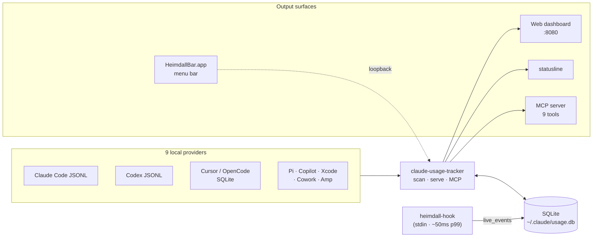
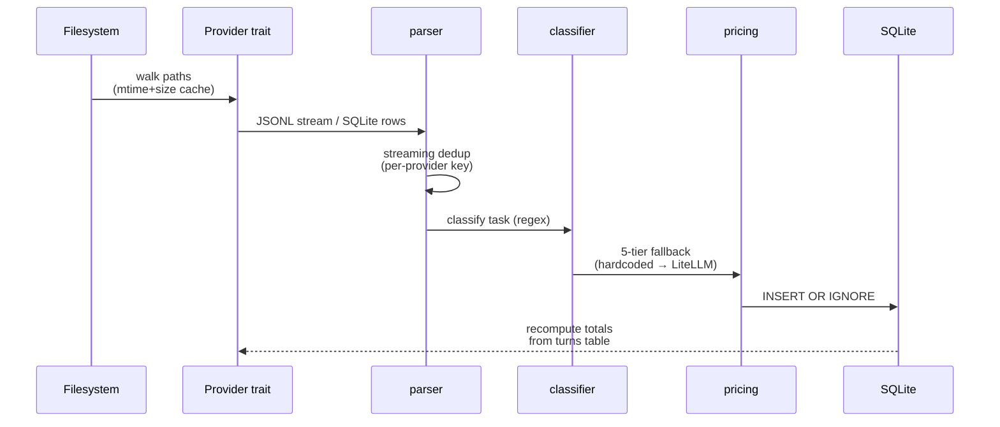

# Architecture

Heimdall ships as two Rust binaries that share one library crate, plus a Preact dashboard compiled into the server binary. This page covers high-level architecture, the data-flow pipeline, and the source layout. For OAuth-specific flow, see [auth.md](auth.md).

## High-level architecture



## Data-flow pipeline



The pipeline runs on `cargo run -- scan` and again on every file-watcher event (`dashboard --watch`). `heimdall-hook` writes directly into `live_events` without going through the scan pipeline so per-tool cost lands in <50 ms.

### How it works (step by step)

1. **Scan** — walks provider-specific filesystem paths for session logs (JSONL / SQLite / mixed-format).
2. **Parse** — extracts provider-aware session metadata, per-turn token usage, subagent flags, service tier, tool invocations with captured arguments (file paths, bash commands) where present.
3. **Classify** — 13-category regex classifier assigns each turn a task category using tool names + first-user-message heuristics.
4. **Estimate** — computes turn-level API-equivalent cost snapshots with pricing version + confidence metadata; breaks down into input / output / cache-read / cache-write components that sum exactly. Amp sessions skip USD estimation; credits are stored as a separate nullable column.
5. **Attribute** — splits each turn's cost evenly across its tool invocations (remainder to the first event) into `tool_events` so per-tool cost queries are tractable.
6. **Deduplicate** — streaming events sharing the same provider-specific dedup key are collapsed (last record wins).
7. **Store** — upserts into a local SQLite database at `~/.claude/usage.db`.
8. **Serve** — axum HTTP server delivers the dashboard UI and JSON API; MCP server exposes 9 tools to Claude / Cursor / Claude Desktop.
9. **Reconcile** — optionally compares Codex local estimates to OpenAI organization usage buckets; compares Anthropic hook-reported cost vs locally calculated cost and surfaces drift > 10 %.
10. **Monitor** — polls Claude OAuth API for real-time rate windows (optional), parses usage-limits files as a fallback source.
11. **Watch & push** — with `dashboard --watch`, a `notify`-backed file watcher triggers in-process rescans and broadcasts via `/api/stream` SSE; `heimdall-hook` writes live per-tool-call events directly into the DB; `statusline` reads cached data for <5 ms warm-path renders.

## Source layout

```
src/
  lib.rs               -- Library root shared between both binaries
  main.rs              -- Primary CLI (clap): scan/today/stats/weekly/blocks/
                          statusline/mcp/config/dashboard/export/optimize/
                          scheduler/daemon/hook/db/menubar/pricing
  config.rs            -- TOML + JSON config loading, $schema support,
                          commands.<name> per-command overrides, resolvers
  models.rs            -- Shared data types (Session, Turn, ToolEvent,
                          CacheEfficiency, DailyProjectRow, SessionRow, ...)
  pricing.rs           -- Single pricing source, 4-way CostBreakdown, 5-tier fallback
  currency.rs          -- Frankfurter USD->N conversion + 24h disk cache
  locale.rs            -- BCP-47 locale parsing + chrono format_localized
  litellm.rs           -- LiteLLM catalogue fetch + cache
  tz.rs                -- TzParams for timezone-aware SQL bucketing
  jq.rs                -- Embedded jaq engine for --jq post-processing
  export.rs            -- `export` subcommand with stdout-dash support
  menubar.rs           -- SwiftBar widget renderer + injection sanitizer
  db.rs                -- TTY-guarded `db reset` command
  webhooks.rs          -- Webhook notification system
  openai.rs            -- OpenAI organization usage reconciliation client
  analytics/
    blocks.rs          -- 5-hour billing blocks, burn rate, projection, gap blocks
    quota.rs           -- Token quota severity (ok/warn/danger)
    burn_rate.rs       -- Burn-rate tier classification
  agent_status/        -- Upstream provider health (Claude + OpenAI) with rolling uptime
  status_aggregator/   -- StatusGator community signal (opt-in)
  oauth/               -- Claude OAuth (credentials, refresh, API, models)
  statusline/
    mod.rs             -- run() orchestrator with cache + lock + fallback
    input.rs           -- stdin JSON schema (bare or object cost shape)
    cache.rs           -- File cache + PID semaphore with stale-lock steal
    compute.rs         -- session/today/block aggregation
    context_window.rs  -- hook-payload + transcript-fallback resolver
    render.rs          -- Layout composer with severity + burn-rate tier
    install.rs         -- statusLine entry in ~/.claude/settings.json
  mcp/                 -- Model Context Protocol server (stdio + HTTP transports)
    tools.rs           -- 9 tool implementations via rmcp #[tool_router]
    install.rs         -- Sentinel-protected .mcp.json installer
  scanner/
    classifier.rs      -- 13-category task classifier
    oneshot.rs         -- Edit->Bash->Edit retry detection
    cowork.rs          -- Ephemeral Cowork label resolution
    usage_limits.rs    -- Usage-limits file parser
    watcher.rs         -- `notify`-backed file watcher (--watch flag)
    provider.rs        -- Provider trait + SessionSource
    providers/         -- claude, codex, xcode, cursor, opencode, pi, copilot, amp
  hook/                -- heimdall-hook binary (bypass, ingest with context window
                          + hook_reported_cost_nanos, install)
  optimizer/           -- 5 waste detectors + A–F grade
  scheduler/           -- Cross-platform scheduler (launchd, cron, schtasks) + daemon
  server/              -- axum server, API endpoints (billing-blocks, context-window,
                          cost-reconciliation, community-signal, ...), SSE stream,
                          embedded assets, MCP sub-router
  ui/                  -- Preact + Tailwind v4 dashboard (compiled JS/CSS committed)

schemas/
  heimdall.config.schema.json  -- Generated JSON Schema for IDE autocomplete
```

See [CLAUDE.md](../CLAUDE.md) for the detailed module-by-module contract and [AGENTS.md](../AGENTS.md) for development conventions and extension playbooks.

## Data sources

Heimdall auto-discovers sessions across nine local tools. See [data-sources.md](data-sources.md) for the full path table.
