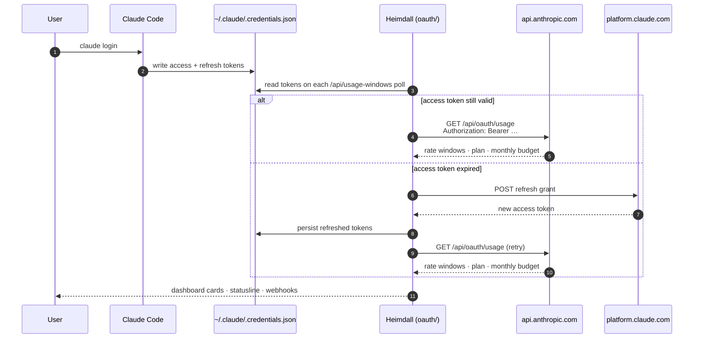
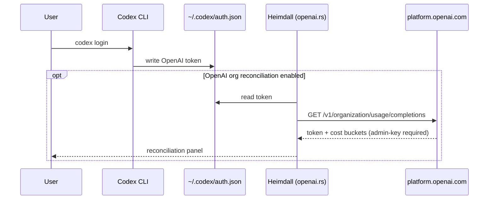

# Authentication & credentials flow

Heimdall reads existing credentials written by upstream tools — it never asks the user to log in. This doc explains how the OAuth flow works for each provider and where each credential lives on disk.

## Claude OAuth flow



### Configuration

```toml
[oauth]
enabled = true
refresh_interval = 60   # seconds; cached in RwLock<Option<(Instant, Data)>>
```

If `[oauth] enabled = false`, Heimdall falls back to parsing `~/.claude/**/*-usage-limits` snapshot files to populate rate-window data without touching the network. The dashboard card shows "OAuth disabled — using snapshot fallback" when this path is active.

### Files Heimdall touches

| Path | Purpose |
|---|---|
| `~/.claude/.credentials.json` | Read access + refresh tokens; rewritten after refresh |
| `~/.claude/**/*-usage-limits` | Read-only snapshot fallback when OAuth disabled |
| `~/.cache/heimdall/oauth_usage.json` | Optional disk cache of last successful response |

### Webhook alerts

When configured (`[webhooks] session_depleted = true`), Heimdall fires:

- `session_depleted` — an active rate window hits 100 %.
- `session_restored` — a previously-depleted window resets.
- `cost_threshold` — local total exceeds `cost_threshold` USD.

Each webhook is a fire-and-forget `POST` with retry-once-on-5xx; failures land in `~/.local/state/heimdall/webhook.log`.

## Codex / OpenAI credentials

Codex sign-in writes to `~/.codex/auth.json` (or `$CODEX_HOME/auth.json`). Heimdall reads this opportunistically:



Codex JSONL session files (`~/.codex/sessions/*.jsonl`, `~/.codex/archived_sessions/`) are parsed without OAuth — those drive local cost estimation. The OAuth path is only for *reconciliation* against OpenAI's official organization usage buckets, gated by `[openai] enabled = true` and `OPENAI_ADMIN_KEY` env var.

## Browser session import (Heimdall only)

`Heimdall.app` can import a browser session (Safari, Chrome, Arc, Brave) for provider dashboard extras that aren't exposed via OAuth. Imported material is stored in Keychain — never in plaintext repo files. See [heimdall.md § privacy model](heimdall.md#privacy-model).

## Network surface

| Outbound | When | Purpose |
|---|---|---|
| `api.anthropic.com` | every `refresh_interval` | OAuth usage windows (Bearer auth) |
| `platform.claude.com` | when access token expires | Refresh grant |
| `status.claude.com` | every `/api/agent-status` poll (cached 60 s) | Public status JSON, ETag-conditional |
| `status.openai.com` | every `/api/agent-status` poll | Public status JSON, two-call (summary + components) |
| `api.frankfurter.app` | on first conversion per 24 h | Currency rates (USD → display currency) |
| `raw.githubusercontent.com/BerriAI/litellm` | `pricing refresh` | LiteLLM model catalogue (long-tail pricing fallback) |
| `api.statusgator.com/v3` | every `[status_aggregator] refresh_interval` (opt-in) | Crowdsourced community signal |

Everything else is local: SQLite, file-watcher, loopback dashboard server, MCP transport.
